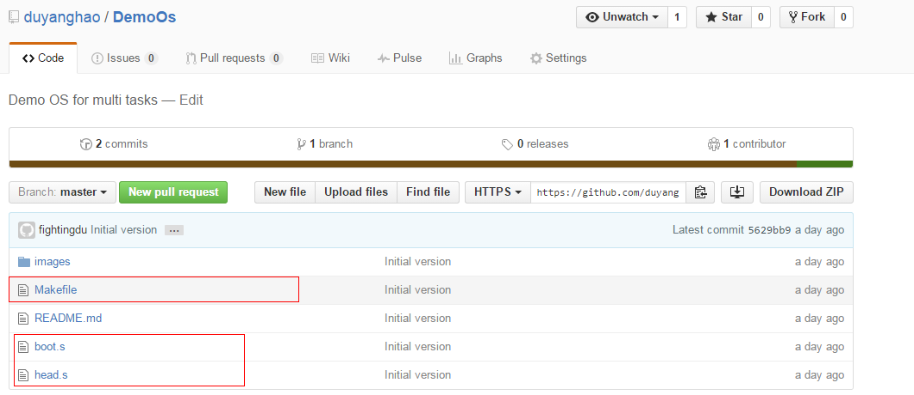

内核是一个运维开发人员进阶的必要知识，许多高层应用都利用了内核的一些特性，包括最近几年特别流行的Docker技术，要理解这些高层应用技术，则必须熟悉内核。这里给出一个我在学习内核的过程中遇到的一个很经典的内核demo例子，作为内核的入门，个人认为是非常有用的！


直接通过git将代码拉下来，下面是该内核代码在Linux 0.12环境下编译后在Bochs下的模拟执行图： 



```c
static int mem_cgroup_swappiness_write(struct cgroup *cgrp, struct cftype *cft,
                       u64 val)
{
    struct mem_cgroup *memcg = mem_cgroup_from_cont(cgrp);
    struct mem_cgroup *parent;

    if (val > 100)
        return -EINVAL;

    if (cgrp->parent == NULL)
        return -EINVAL;

    parent = mem_cgroup_from_cont(cgrp->parent);

    mutex_lock(&memcg_create_mutex);

    /* If under hierarchy, only empty-root can set this value */
    if ((parent->use_hierarchy) || memcg_has_children(memcg)) {
        mutex_unlock(&memcg_create_mutex);
        return -EINVAL;
    }

    memcg->swappiness = val;

    mutex_unlock(&memcg_create_mutex);

    return 0;
}
```
